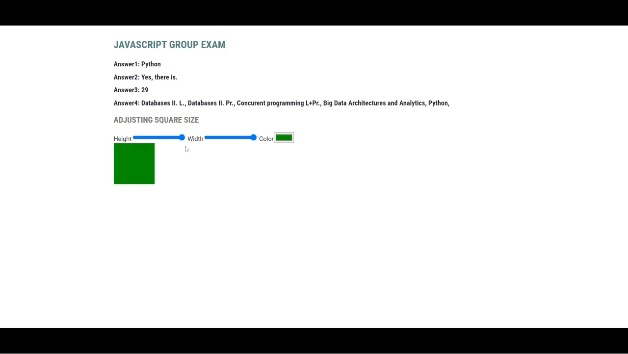

# JavaScript Group TEST

Please do the tasks inside the script tag in the HTML file, or copy it inside the HTML file at the end. You should only hand in an HTML file to EBR here: [http://webprogramozas.inf.elte.hu/ebr/public/index.php](http://webprogramozas.inf.elte.hu/ebr/public/index.php)

Here you can see your two tasks:

## 1. Subjects (5 points)

You have an array representing a student's enrolled subjects for a semester. Solve the following tasks using array functions if possible (you can do the tasks with simple for loop,if you can't do it with array functions). Always append your answers to the appropriate h3 heading with the `answer` class. `Hint: You can select all of them with one selector and then reference the nth element in the list`

1. Provide the name of the first subject without prerequisites. (1 point)
2. Is there a subject with no prerequisites and worth 5 credits? Display the result in complete sentence like `Yes, there is./No, there is not.`
3. Calculate how many credits the student has taken. (1 point)
4. Select the subjects related to informatics. It's enough to display the resulting array. (2 point)

## 2. Adjusting Square Size (5 points)

The task is to adjust the size of a square using input ranges and change its color using a color picker. Add `input` event listeners to the sliders and the color input field. These work similarly to text input fields, so you can set and retrieve their values using the `value` property.

1. Set the initial values of all three input fields to match the initial style values of the div! (2 points)
2. Add event handlers to the range inputs and change the size of the square! (2 points)
3. When adjusting the color input field, change the color of the square! (1 point)
